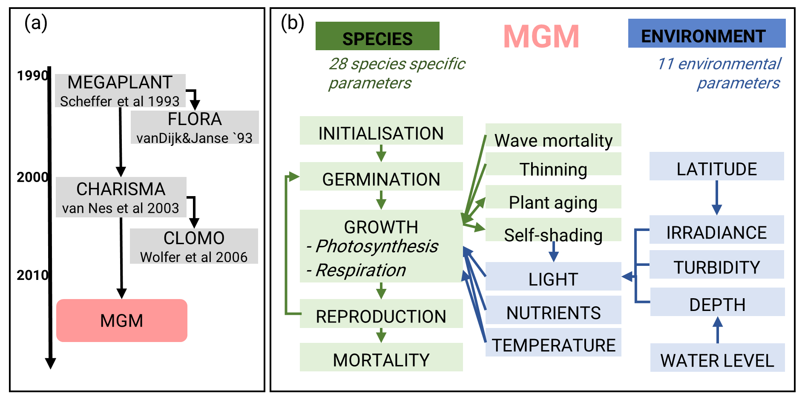

# Process-based models

## EcoMods models

Here, you will find all of our working group's models. For specific
questions for each model, please refer to the respective lab member.

### GeMM

TODO Robin

### MGM

MGM (Macrophyte Growth Model) is a process-based, eco-physiological
model simulating the growth of submerged macrophytes under different
environmental conditions. MGM is a simplified re-implementation of
Charisma 2.0 [@vannes2003] in Julia language. The model scheme is
depicted in \@ref(fig:MGM) .

```{r MGM, fig.cap="Model phylogeny of MGM (a) and simplified model scheme (b).", echo=FALSE}

```


Documentation and code is open access on
[GitHub](https://github.com/AnneLew/MGM).

Further questions: ask Anne

### metaRange

general info - TODO JANA & STEFAN

#### R version

TODO Stefan

#### Julia Version

TODO Jana
