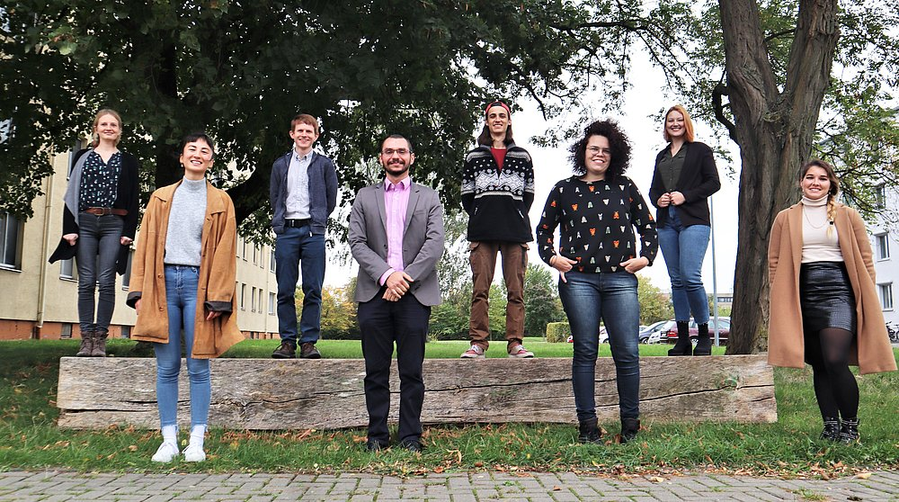

# Hello and welcome to the EcoMods working group!

In this document, you will (hopefully) find everything you need for your
course / internship / thesis with us. The very first things you should
do before starting your work are:

-   **Mailinglists**: subscribe to the CCTB and EcoMods [mailing
    lists](https://lists.uni-wuerzburg.de). Select CCTB and ecomod-cctb
    and register using your email address. These lists are used for
    announcements of talks or other important events.

-   **Account**: get an account in the CCTB server. Our IT support,
    Patrick Haag (patrick.haag(at)uni-wuerzburg.de), can do this for
    you.

-   **Keys**: get access to the building. Your student ID card needs to
    be unlocked to be able to use it as a key for all doors. Patrick
    will also help you with this.

-   **Mattermost**: remind your supervisor to send you an invitation
    link for our
    [Mattermost](https://cctb-intern.biologie.uni-wuerzburg.de). We use
    Mattermost for CCTB-wide communication. Be aware that the
    certificate for enabling https is self-signed. This means when you
    visit the Mattermost site for the first time, you will have to add
    it as an exception. Mattermost contains channels for different
    purposes like organizational stuff, lunch planning, working groups,
    etc. It is very similar to Slack, if you have used that before.
    There is also a [Desktop
    App](https://about.mattermost.com/download/#mattermostApps).

-   **Meetings**: save these time slots for obligatory participation:

    -   weekly CCTB seminar, Wednesdays 11:00-12:00
    -   weekly EcoMods lab meeting, Thursdays 13:30-15:00

-   **Gathertown**: we also have a CCTB Gathertown which is basically a
    virtual office space. It was used a lot during home office times,
    now, not as much anymore. But if you post on Mattermost that you
    would like to meet for a virtual coffee break, people will show up!
    You'll find the link in the header of the town-square channel on
    Mattermost

-   **IT questions:** if you ever run into any IT-related problems that
    you cannot solve alone, post it in the Mattermost IT channel.

We hope that this document helps you to learn more about how to do
Ecological Modeling and how to navigate life at the CCTB. If you have
any questions, you can come by our offices or send us an email any time.

We also gladly accept any suggestions on how to improve this guide, so
let us (Figure \@ref(fig:EcoMods)) know if you feel that anything is
missing!

```{r EcoMods, fig.cap="The EcoMods in 2020", echo=FALSE}

```

## How to edit this booklet

## Missing sections & TODOs

*Juliano*, do you have scripts for these points below that I could link?

Playing with R Codes - Intro R - First Models - Intro Ecological
Functions and Simulations Exercise - First Functions and Simulations -
Shiny
